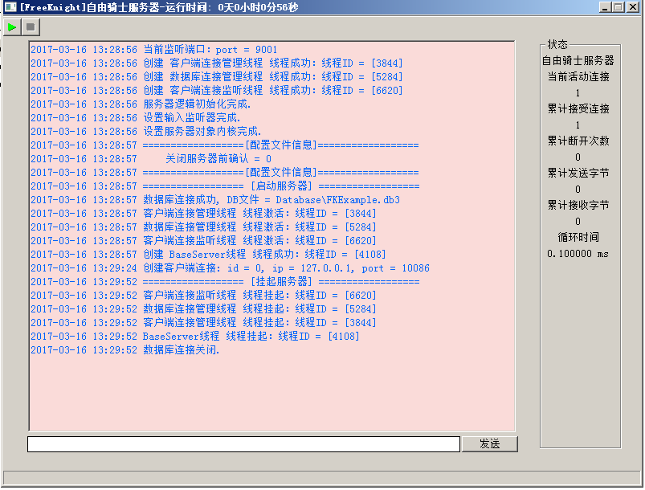
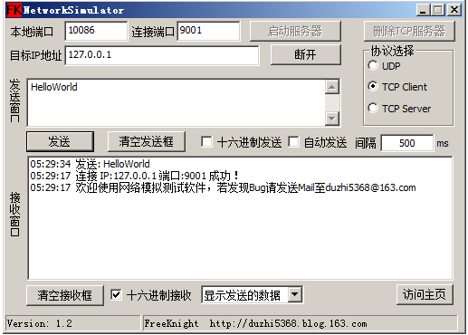

# FKSimpleServerFramework

A simple server written by C++. With a nice message simulator depend on MFC.

* It is quite smart, lite and easy to learn.
* It is zero depends.
* It is a nice server framework.
* With full comment.
* The simulator can easily used in any projects.

- DB - Use Sqlite3
- UI - Use EasyGui
- Dev IDE - Visual Studio 2013/2015

